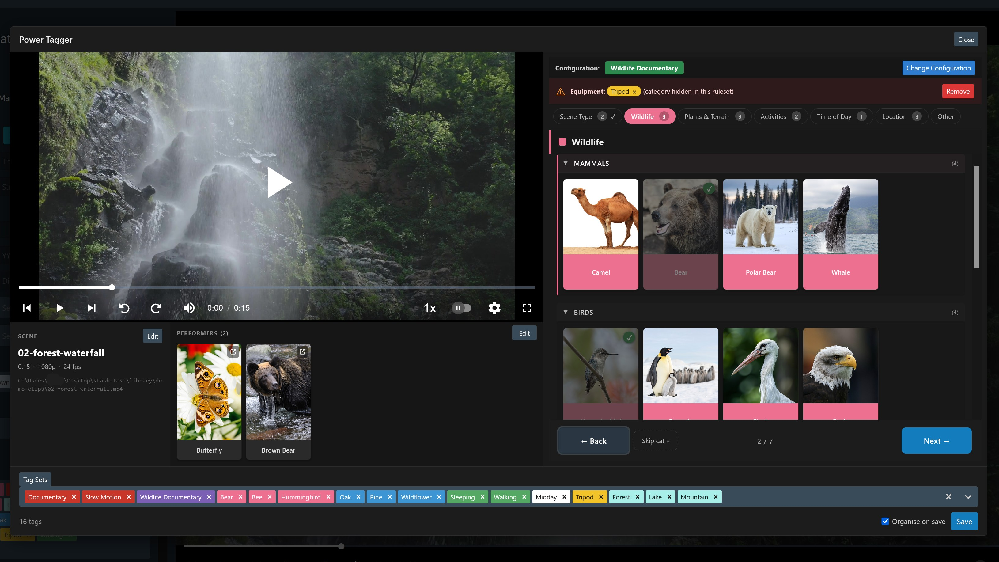
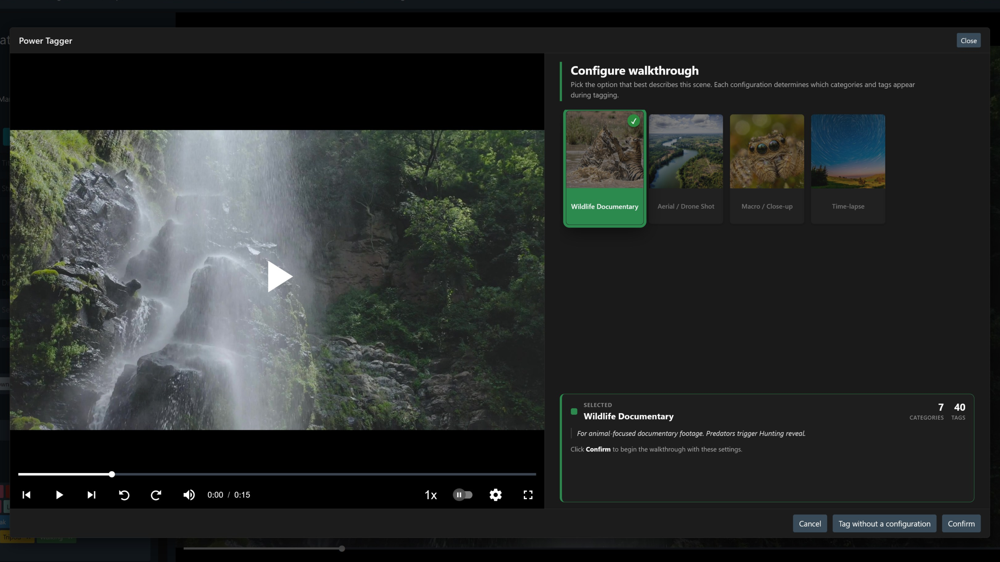
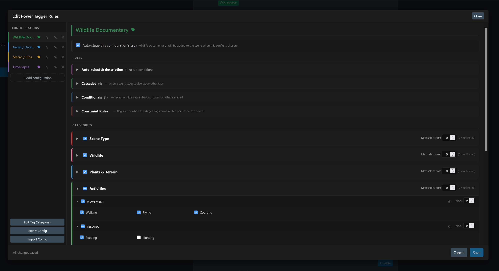

# Power Tagger

A [Stash](https://github.com/stashapp/stash) plugin that conditionally filters and structures your tagging, so you don't have to sort through hundreds of tags to find the ones that actually apply.

Stash's built-in tag picker shows the same flat list every time, no matter what type of scene it is. Once your library passes enough tags, this very quickly starts becoming pretty unwieldy.

Power Tagger replaces this with **configurations** (one per kind of scene), each carrying rules about which tags to show, hide, cascade, and constrain. You only see tags that apply to the scene in front of you, and any existing tags that break the rules get flagged so you can accurately clean them up.

Requires [Tag Categories](https://github.com/pineapplestorm/pineapplestorm-stash-plugins/tree/main/plugins/tag-categories), which supplies the category structure Power Tagger uses to lay out your tags.



## What it does

### Filter and group your tags per scene type

A typical Stash library can often grow to hundreds of tags. The default tag picker shows all of them every time. Power Tagger lets you set up a **configuration** for each kind of scene you tag, and each one hides the tags that don't apply.

For example - a solo scene shouldn't show tags for compilations or group scenes, and conversely, a group scene shouldn't show tags that relate to solo scenes. With the right Power Tagger rules setup, you just see the tags that make sense for the scene in front of you, instead of every tag in your whole library.

Within that filtered list, tags are grouped by the categories and sub-categories you set up in [Tag Categories](https://github.com/pineapplestorm/pineapplestorm-stash-plugins/tree/main/plugins/tag-categories), so you can scan a whole category at a glance instead of recalling and manually typing each tag name from memory.



### Configurations and rules

Each configuration can carry a fuller ruleset:

- **Auto-select configuration**: a rule that picks the configuration automatically for you. For example: A "two-performer" configuration that triggers when the scene has exactly 2 performers tagged. A studio-specific configuration that triggers when the scene's file path contains that studio's folder name - or when a scene has that studio already associated and tagged to it. You can even set up a performer-specific configuration that triggers when a particular performer is in the scene.
- **Cascades**: tagging one thing automatically tags another. E.g. tagging "Beach" adds "Outdoor" too. Or tagging "Pool", or "Swimming" adds the other, along with "Outdoor".
- **Conditional visibility**: reveal or hide categories and tags based on what's already staged. For instance, tagging "Solo" can hide entire categories, sub-categories, or individual tags that only apply to group scenes - and vice versa. Helping clean up and narrow down your options.
- **Selection caps**: limit how many tags from a category/sub-category that can be applied at one time. Useful when only one answer makes sense, for example: like "at most one production era" etc.
- **Constraint rules**: caps that optionally scale with the scene's performers, for example "at least one type of location tag per scene", or - "at most one hair colour tag per female performer in the scene".

Each configuration has its own colour, which shows up on the configuration screen, the walkthrough header, and the rules editor.



### Keep your tagging accurate

The same rules that filter the tag view also audit what's already there. Open Power Tagger on a scene that's already tagged (from a scraper, or tagged before you set up your configurations) and any tags that break the rules get flagged. - A quick way to clean up messy tagging without a separate review pass.


### Stage, then save

Toggle tags on and off as you go. Nothing commits until you click **Save**, which applies everything in a single update. The standard Stash tag picker sits below the category view, so you still can type and apply any tag manually - the usual method for Stash. The rules narrow the default view; they don't lock anything out.

### Batch tag multiple scenes in a row

Select one or more scenes on the Scenes page and the **Power Tagger** toolbar button opens them up as a queue. Saving one advances to the next. Cancelling leaves the queue and keeps everything you've already saved.

### Plain mode: no configurations needed

While it is best used with a custom rules engine you have setup, Power Tagger still works on a fresh library with no configurations set up. It falls back to plain category-grouped tagging with the rules engine off. You can also at any time tag a scene without using a configuration, via the **Tag without a configuration** button on the opening configuration screen.

### Backup and sync your rules

The rules editor has an **Export** and **Import** function. Export writes a JSON file with all your configurations and rulesets. Import reads one back, after a confirm prompt so you know exactly what's about to overwrite. Handy for backing up your rulesets, or syncing across machines.

## Requirements

Install the **Tag Categories** plugin first. Power Tagger reads your category structure from it. Without it the modal will still open, but every tag falls into a single "Uncategorised" group and you lose most of the structure.

## Installation

### Via plugin source (recommended)

In Stash, go to **Settings → Plugins → Available Plugins → Add Source** and paste:

```
https://pineapplestorm.github.io/pineapplestorm-stash-plugins/main/index.yml
```

Find **Power Tagger** in the list and click Install. Stash will notify you when a new version ships.

### Manual install

Download this repo as a zip, drop the `power-tagger` folder into your Stash plugins directory, and click **Reload Plugins** in Stash settings. No automatic updates this way.

## License

AGPL-3.0. See [LICENSE](LICENSE) for the full terms.
